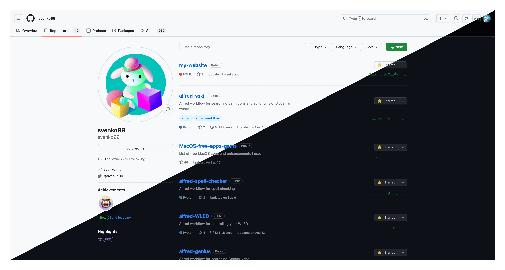

# 🔲 Diagonal Blend Tool

This is a simple command-line tool designed to blend two images along a diagonal axis.
Its creation was inspired by the desire to showcase both the dark and light modes of my website within a single image.

## 📝 Examples



## 📊 Usage

### Prerequisites

- Python 3.x
- Pillow library (`pip install Pillow`)

### Both images need to have the same size, otherwise the script won't work!

- I achieve this by using Firefox's tool `Take screenshot` when I right click on a website, and I click `Save visible`. I take a screenshot when the website is in light mode, and then another one when the website is in dark mode.

### Installation

1. Clone the repository:

   ```bash
   git clone https://github.com/svenko99/diagonal-blend-tool.git
   ```

2. Navigate to the project directory:

   ```bash
   cd diagonal-blend-tool
   ```

3. Run the script by providing paths to the input images and the desired output path:

   ```bash
   python src/main.py image1.png image2.png output.png
   ```
