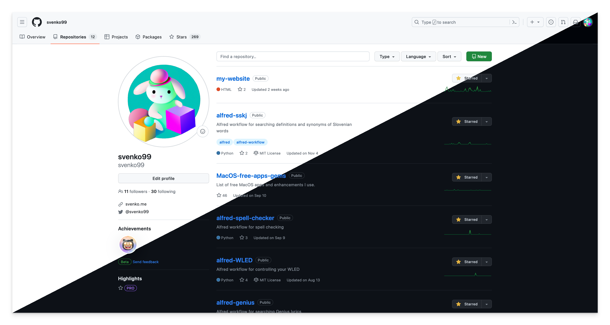
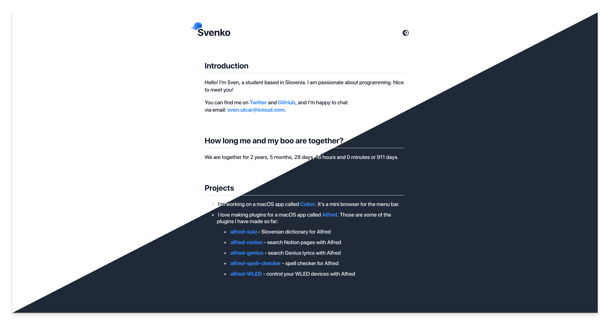

# Dark Light Showcase Tool

This is a simple command-line tool designed for showcasing light and dark modes of websites by overlaying two images with a triangle mask. It utilizes the Python Imaging Library (PIL) for image processing.

## Examples





## Usages

### Prerequisites

- Python 3.x
- Pillow library (`pip install Pillow`)

### Installation

1. Clone the repository:

   ```bash
   git clone https://github.com/your-username/your-repo.git
   ```

2. Navigate to the project directory:

   ```bash
   cd your-repo
   ```

### Usage

Run the script by providing paths to the input images and the desired output path:

```bash
./overlay_images.py image1.png image2.png output.png
```
